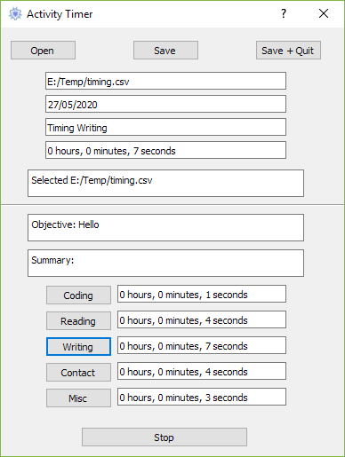

# Activity Timer

Sometimes I find it hard to manage my time in the day between the different work I need to do. This is designed to help that.

## Installation

```
git clone https://github.com/seankmartin/ActivityTimer
cd ActivityTimer
python -m pip install -r requirements.txt
fbs run
```

## Features

- Time activities each day and provide an objective and summary.
- Demonstrates the use of the fbs build system, Pyqt5 timers and file dialogs, auto-saving every 2 minutes.

## User interface

The user interface is very simple, it looks like this:



## Roadmap

Things I'd like to add, ordered by likelihood of completion.

1. A viewer for the Activity Timer output, to see work done each day.
2. Custom activities. Currently, changing the name of the activities would be little effort, but customising the number would be.

## Licensing

This project is licensed under the MIT license.
